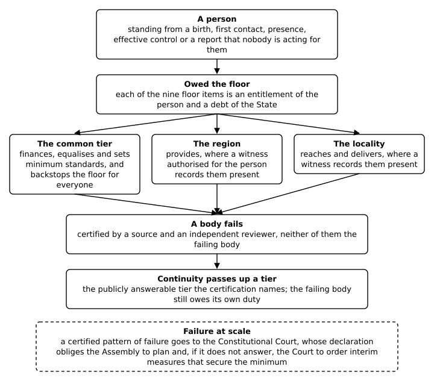
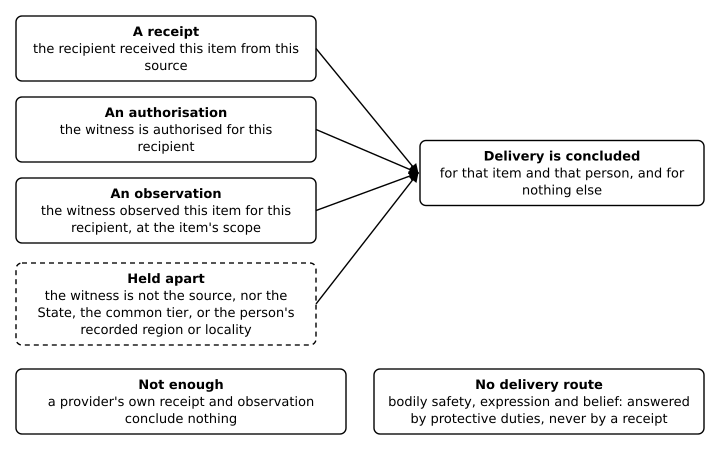
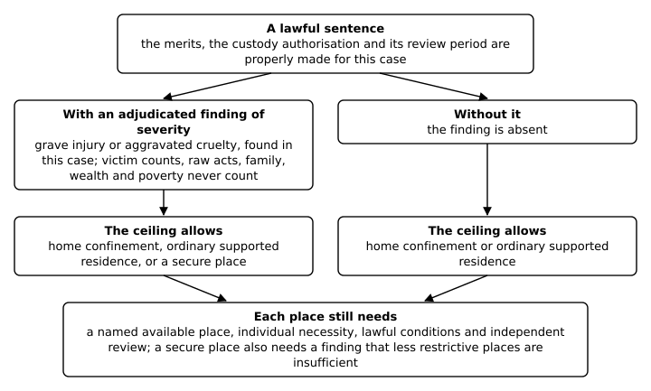
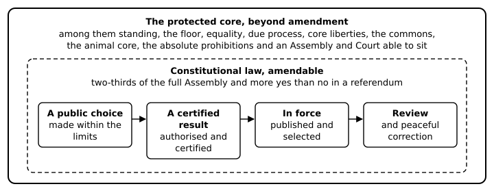
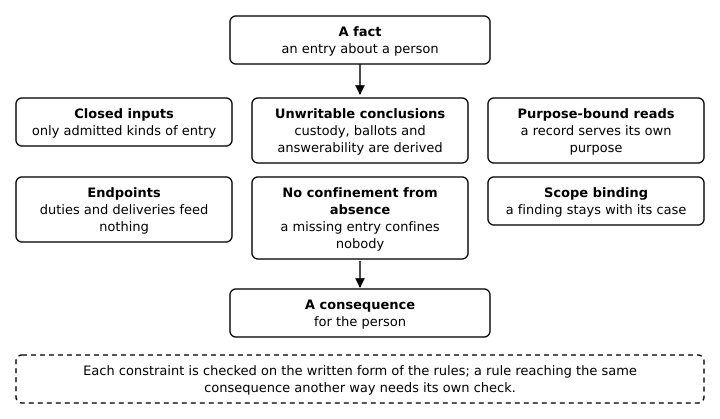

# Map, Glossary and Index

The [opening note](00-opening-note.md) states the book's question and how to
read it. The maps, contents, glossary and index below lead back into the
chapters.

## Reader's Map

Return here for [choices and arguments](#the-choices-and-their-arguments),
[contents](#annotated-contents), [terms](#concise-glossary),
[roles and cases](#roles-bodies-and-cases), [subjects](#domains-and-chapters),
or [diagrams](#accessible-diagrams). Each is a way into the chapters, not a
separate source of constitutional rules.

The order is editorial: provision and ordinary freedom come before the powers
and failures that threaten them. The rules' dependency order is a separate
technical matter explained in the method's section [*A refusal is a result
about an input*](method.md#a-refusal-is-a-result-about-an-input).

### The choices and their arguments

Use this map to put a mechanism beside its justification. The case chapters
show consequences of the rules and the recorded evidence; each closes with an
argument explaining why I choose its rule and what would favour a different
arrangement, and Part V draws the choices together.

| Choice and its consequences | Where it is argued |
|---|---|
| [Public responsibility for essentials](06-who-owes-and-what-follows.md) (Chapter 6), with [different providers and public finance](10-what-money-cannot-buy.md) (Chapter 10) | [Named goods rather than cash](03-what-you-are-owed.md#argument-owed-to-everyone-by-someone) (Chapter 3), [named bearers](06-who-owes-and-what-follows.md#argument-named-bearers-and-a-court-that-secures-the-minimum) (Chapter 6) and [borrowing under law](10-what-money-cannot-buy.md#argument-ownership-under-the-floor-borrowing-under-law) (Chapter 10) |
| [Allocation when claims conflict](05-when-there-is-genuinely-not-enough.md) (Chapter 5) | [Proved shortage and need](05-when-there-is-genuinely-not-enough.md#argument-a-shortage-must-be-proved-and-need-decides-it) (Chapter 5), and [separate human, ecological and animal claims](29-the-five-joints.md#valuation) (Chapter 29) |
| [Regional powers and a collective executive](17-how-public-power-is-built.md) (Chapter 17) | [A divided government that can still decide](17-how-public-power-is-built.md#argument-divided-without-deadlock) (Chapter 17) |
| [Independent appointments](17-how-public-power-is-built.md#how-somebody-comes-to-hold-an-office) (Chapter 17) | [Divided sources against a minister's or the judiciary's own choice](17-how-public-power-is-built.md#argument-divided-without-deadlock) (Chapter 17) |
| [Residence and the retained vote](18-the-vote-conviction-does-not-take.md) (Chapter 18) | [Residence and the all-affected alternative](15-arriving-and-belonging.md#argument-the-person-before-the-status) (Chapter 15) and [the vote outside the sentence](18-the-vote-conviction-does-not-take.md#argument-the-vote-outside-the-sentence) (Chapter 18) |
| [Limits on records and their reuse](19-what-may-be-kept-about-you.md) (Chapter 19) | [The closed record](02-what-the-record-may-say.md#argument-why-the-record-is-closed-by-name) (Chapter 2), [uses bound to their holding](19-what-may-be-kept-about-you.md#argument-uses-bound-to-their-holding-decisions-to-a-person) (Chapter 19) and [privacy against coordination](29-the-five-joints.md#capture) (Chapter 29) |
| [Protection after exposing authority](23-the-shield.md) (Chapter 23) | [Lasting answerability](16-answerability-and-authority.md#argument-answerable-for-good-empowered-for-now) (Chapter 16) and [protection that follows the charge](23-the-shield.md#argument-protection-that-follows-the-charge) (Chapter 23) |
| [Custody and retained rights](27-the-one-thing-taken.md) (Chapter 27) | [A power that takes movement and then expires](27-the-one-thing-taken.md#argument-a-power-that-takes-movement-and-then-expires) (Chapter 27), [severity as a ceiling](26-where-people-are-put.md#argument-proved-harm-opens-the-harshest-place) (Chapter 26) and [the coercion joint](29-the-five-joints.md#coercion) (Chapter 29) |
| [Emergency powers](20-a-crisis-does-not-suspend-the-republic.md) (Chapter 20) | [Four powers and every right in force](20-a-crisis-does-not-suspend-the-republic.md#argument-four-powers-and-every-right-in-force) (Chapter 20) |
| [The unamendable cores](22-changing-the-rules.md) (Chapter 22) | [A fixed core behind an open route](22-changing-the-rules.md#argument-a-fixed-core-behind-an-open-route) (Chapter 22) and [the animal core](13-creatures-without-a-ballot.md#argument-a-claim-of-its-own) (Chapter 13) |

### Where a decision belongs

The **protected core** is what constitutional amendment must preserve.
An **institutional mechanism**, such as an appointment procedure, is a chosen
means of serving those commitments. It binds the government while in force,
but it can be changed through the lawful amendment route while preserving the
core. A rule's current constitutional status does not make it unamendable.

The book distinguishes five kinds of question. A **constitutional invariant**
binds every public decision. A **democratic choice** belongs to public law
within those limits. A **protected private or civic freedom** belongs to people
without an official prescribing the result. An **operation** concerns the
staff, resources and work needed to put a decision into practice. An **external
assumption** concerns something this design cannot guarantee, such as an honest
witness or cooperation from another state. One subject can contain all five.
Calling a constitutional defect an operating problem does not resolve it.

Public duties distinguish respecting a right, protecting it from interference,
fulfilling the public floor, maintaining continuity and remedying a breach.
Each duty belongs to the body, function, jurisdiction and scope its lawful
source names. None shows that the body acts. The chapters keep a duty,
a lawful action and evidence of its result distinct.

## Annotated contents

The [epigraph](epigraph.md) and the [opening note](00-opening-note.md) precede
the chapters. The numbered chapters form the main reading sequence; the method
and this reference material follow them.

### Part I — Who counts, and what they are owed

- [Opening case: The Sports Field at Wallacedene](part-1-the-sports-field-at-wallacedene.md)
  — families evicted in the Cape winter, and a judgment that declined to define
  what everyone is owed.
- [Chapter 1: The Child With Nobody](01-the-child-with-nobody.md) — what follows
  from a birth entry, what remains invisible when no entry exists, and every
  other way into the record, without papers, citizenship or a family.
- [Chapter 2: What the Record May Say](02-what-the-record-may-say.md) — which
  entries the rules accept, and what a temporary encounter name cannot prove.
- [Chapter 3: What You Are Owed](03-what-you-are-owed.md) — the floor and the
  difference between entitlement and fulfilment.
- [Chapter 4: Whether It Arrived](04-whether-it-arrived.md) — recipient-side
  evidence of delivery, including independent witnessing.
- [Chapter 5: When There Is Genuinely Not Enough](05-when-there-is-genuinely-not-enough.md)
  — the evidence and limits governing a shortage, and what remains owed.
- [Chapter 6: Who Owes, and What Follows](06-who-owes-and-what-follows.md) — public
  responsibility, continuity and remedy when an ordinary route fails, with one
  claim followed through every office that fails it.

### Part II — The life the design leaves alone

- [Opening case: Unprecedented Injustice](part-2-unprecedented-injustice.md) —
  parents branded as fraudsters by rules with no room for a family's own case.
- [Chapter 7: An Ordinary Week](07-an-ordinary-week.md) — one adult's week of
  work, a home, a clinic, a school, a ballot, a dispute and a police stop, and
  how lightly the rules touch it.
- [Chapter 8: What Nobody Has to Ask Permission For](08-what-nobody-has-to-ask-permission-for.md)
  — learning, speech, belief, association and the limits on public prescription.
- [Chapter 9: Work, Pay and Contribution](09-work-pay-and-contribution.md) — wages,
  supplements and competence without conditions on essentials, and records of
  contribution without a score or price on a person.
- [Chapter 10: What Money Cannot Buy](10-what-money-cannot-buy.md) — property,
  enterprise, exchange and public finance under constitutional limits.
- [Chapter 11: The Same Route for Everyone](11-the-same-route-for-everyone.md)
  — discrimination, accommodation, justified distinctions and repair.
- [Chapter 12: A Place in Which Life Remains Possible](12-a-place-in-which-life-remains-possible.md)
  — the environmental right, ecological limits and future conditions.
- [Chapter 13: Creatures Without a Ballot](13-creatures-without-a-ballot.md) —
  animals' own interests, the uses that need grounds and the orders that stop harm.
- [Chapter 14: Holding a Role in Somebody's Life](14-holding-a-role-in-somebodys-life.md)
  — care, family, consent, supported agency and public continuity.
- [Chapter 15: Arriving and Belonging](15-arriving-and-belonging.md) — mobility,
  asylum and collective belonging without a price on personhood.

### Part III — The public power that serves it

- [Opening case: The Brooding Spirit of the Law](part-3-the-brooding-spirit-of-the-law.md)
  — a court that closed its doors to detainees in an emergency, and the
  amendment that reopened them.
- [Chapter 16: Answerability and Authority](16-answerability-and-authority.md)
  — permanent answerability, current office and lawful power as separate things.
- [Chapter 17: How Public Power Is Built](17-how-public-power-is-built.md) — the
  federal republic's bodies, separated functions and routes through disagreement.
- [Chapter 18: The Vote Conviction Does Not Take](18-the-vote-conviction-does-not-take.md)
  — the retained vote and candidacy, adulthood and political home.
- [Chapter 19: What May Be Kept About You](19-what-may-be-kept-about-you.md) —
  purpose-limited records and separate permissions to watch, compute and decide.
- [Chapter 20: A Crisis Does Not Suspend the Republic](20-a-crisis-does-not-suspend-the-republic.md)
  — bounded emergency and external powers.
- [Chapter 21: A Way to Be Heard](21-a-way-to-be-heard.md) — assistance,
  proceedings, remedies and enforcement without an added power to imprison.
- [Chapter 22: Changing the Rules](22-changing-the-rules.md) — political consent,
  candidate certification, publication and the version in force.

### Part IV — What the design does to a person, and how it catches itself

- [Opening case: Three to Ten Years](part-4-three-to-ten-years.md) — prisoners
  held years awaiting trial for offences that might carry months, and a court
  that found a speedy trial in the right to life and liberty.
- [Chapter 23: The Shield](23-the-shield.md) — protection for exposing authority,
  and the conditions for an unrelated prosecution to proceed.
- [Chapter 24: Findings About People](24-findings-about-people.md) — adverse
  credibility findings, whose signatures count, their grounds, review and
  limits, and correcting a claim without condemning unrelated work.
- [Chapter 25: A Prisoner Is a Person](25-a-prisoner-is-a-person.md) — custody as
  an independent backstop to personhood, never its price.
- [Chapter 26: Where People Are Put](26-where-people-are-put.md) — placement,
  housing and the difference between a recorded destination and an actual place.
- [Chapter 27: The One Thing Taken](27-the-one-thing-taken.md) — limits on custody,
  protective powers and what actual release requires.
- [Chapter 28: When the System Notices It Broke](28-when-the-system-notices-it-broke.md)
  — breach markers, the independent offices that must respond, and duties of
  individual and common repair.

### Part V — The argument

- [Opening case: After the Judgment](part-5-after-the-judgment.md) — the
  Wallacedene families after their judgment, and a litigant who died in her
  shack before her house was built.
- [Chapter 29: The Five Joints](29-the-five-joints.md) — the commitments
  beneath the choices, what the design adds, and how the choices fit together
  and trade off over valuation, rotation, coercion, capture and the state.
- [Chapter 30: Where This Could Fail](30-where-this-could-fail.md) — the
  failures that cross chapters, ranked by an argued order, each with the
  evidence that would show it, what the design does now and what a fix would
  take.

### Back matter

- [The Method](method.md) — worked rules, queries, refusals and contradiction
  checks; what each assurance covers and where it stops; and instructions for
  running the book's examples.
- [Works Cited](bibliography.md) — every work the notes cite, in alphabetical
  order, with the chapters that cite it.
- This map, glossary and index, with the diagrams and an alphabetical index of
  terms, bodies, people and cases.

## Concise glossary

- **Entry:** a report given to the rules, such as a birth, judgment or receipt.
- **Record:** the entries given to the rules to read. Its vocabulary can be
  restricted while its contents are false, incomplete or stale.
- **Rule:** a route from specified premises to a conclusion. It does not verify
  the premises for itself.
- **Conclusion:** what follows from the exact rules and the record being
  checked; not an observation of the world.
- **Properly made:** said of a finding, order or review whose every required
  element is present, each from the right source. The elements vary by kind;
  they typically include the subject, case and ground, the evidence and
  procedure, and separate people authorised to decide and to review. Without
  one of them it is incomplete, and its consequences do not follow.
- **In force:** having legal effect now, rather than merely appearing in the
  record. A completed finding stays in force until a properly made act, such as
  restoration on appeal, ends it; an authority stays in force only while its
  source and review remain current.
- **Version in force:** the one current version of the record whose entries
  have legal effect. A finding recorded in an earlier version counts only where
  it is kept, with independent witnesses, in the version in force.
- **Person:** the status from which the floor follows. A birth or encounter can
  ground it; custody and release provide independent backstops.
- **Standing:** the universal status every person holds. It is neither a rank
  nor permission to act on someone.
- **Public answerability:** continuing accountability to examination and exposure,
  held by public bodies and people who have been seated in office.
- **Current lawful authority:** permission for a named holder to exercise one
  exact power in a jurisdiction and scope under the version of the record in
  force. Answerability alone does not give it.
- **Custody authorisation and its review date:** permission to hold one person
  under one case, tied to its constitutional source and to a review period. The
  period has an order but no measured length; its end is the review date. Unless
  a renewal is made by then, the authority ends; its ending is not itself a
  release.
- **Political home:** the chosen local connection from which a resident's regional
  and common democratic home follows. Compelled placement cannot move it.
- **Authority to sign findings:** a permission, concluded by the rules rather
  than simply recorded, for an examiner's finding to count in the paired
  credibility-finding route.
- **Floor:** what every person is owed without conditions of employment,
  registration, belonging, payment or approved behaviour.
- **Bodily safety:** freedom from violence and threats to the person; a floor
  item guaranteed as protection rather than shown by a receipt.
- **Material security:** the essential goods a person needs beyond food and
  shelter; a floor item whose delivery can be concluded from a receipt and an
  independent witness.
- **Protected core:** standing, the floor and other specified human rights,
  commons and direct animal protections that lawful constitutional amendment
  must preserve. It does not include every present institution.
- **Institutional mechanism:** a chosen arrangement for making, implementing
  or reviewing decisions. Its justification is separate from the right it serves.
- **Delivery:** the protected condition reaching a person. A debt, payment or
  institutional output is not enough to show it.
- **Receipt:** a report of delivery. The ordinary receipt route needs matching
  independent evidence before delivery can be concluded.
- **Contribution record:** an entry that someone paid into a named scheme. It
  supports a supplement, never standing, the floor, the vote or liberty.
- **Supplement:** protection through a scheme or public guarantee against a
  recorded event it covers. The conclusion states no amount and proves no
  payment.
- **Competence certificate:** an authorised attestation of a person's competence
  for a function. No other entitlement or permission in the formal record
  depends on it; it is not a licence.
- **Compensation record:** a promised wage, profit, return, grant, prize, subsidy
  or incentive. A compensation conclusion also needs an attestation by someone
  other than the payer, naming the payer and the kind on one basis; neither
  entry states an amount.
- **Public-scale finding:** a finding that one private function carries public
  duties on a named constitutional ground. It does not bind every activity of
  the organisation.
- **Named ground:** the reason a public-scale finding must show, such as
  essentiality, dominance, gatekeeping or absence of real exit. Size alone is
  not a ground.
- **Shield:** protection against conviction-based imprisonment following an
  exposure of authority, while no deceit finding in force applies to that
  exposure. It does not reach a case whose two timing witnesses both record that
  the disclosure came after that case's charge. An unrelated case requires a
  finding by authorised reviewers whose eligibility is positively shown. An actual conflict blocks the affected
  decision; merely naming a reviewer does not.
- **Signing restriction:** a credibility finding in force prevents its subject's
  signature from counting toward a new credibility finding. Other offices are
  unaffected. It leaves the floor intact; restoration identifies the case and
  its ground.
- **Correction:** a claim is assessed on its own grounds. A credibility finding
  does not erase unrelated contributions.
- **Placement:** reviewed authority for a named place of confinement, requiring
  evidence of availability and lawful conditions. It does not show that anyone
  was moved there or received shelter.
- **Breach marker:** a conclusion naming a defect in the record. It does not
  itself investigate, correct, compensate or release anyone.
- **Democratic corridor:** the range of public choices within constitutional
  invariants and protected freedoms, with review and peaceful change.

## Roles, bodies, and cases

### Roles and bodies

- **The State and the constitutional bodies:** the record's `State` owes the
  floor. The republic's constitutional bodies hold separately specified duties
  and powers; the name `State` does not stand for proof that they operate.
  See Chapters [3](03-what-you-are-owed.md),
  [6](06-who-owes-and-what-follows.md) and [17](17-how-public-power-is-built.md).
- **The federal constitutional bodies:** the People's Assembly, Regions
  Council, Executive Council, Civic President, courts and independent offices
  exercise distinct functions. Each power rests on a current source; the rules
  do not show actual staffing or independence. See Chapter
  [17](17-how-public-power-is-built.md).
- **The electorate and convocation:** separate sources of seating, and so of
  the authority to sign findings used in accountability. See Chapters
  [16](16-answerability-and-authority.md) and [24](24-findings-about-people.md).
- **An examiner or auditor:** records examinations. The authority to sign and
  case-specific independence are needed before an examination can count toward
  an adverse finding. A finding against the examiner needs its own case.
  See Chapters [9](09-work-pay-and-contribution.md) and
  [24](24-findings-about-people.md).
- **The court:** records a judgment. That alone gives no current authority to
  confine. See Chapters [23](23-the-shield.md) and
  [27](27-the-one-thing-taken.md).
- **The review and appeals bodies:** receive specified findings, challenges and
  duties to act; a failure to respond, separately shown, can activate an
  alternate. See Chapters [21](21-a-way-to-be-heard.md) and
  [28](28-when-the-system-notices-it-broke.md).
- **The assembly and approving-public entries:** report a proposal and approval.
  They give no separate law-making status. The federal republic's certified
  result and exact candidate need their own authority and review. See Chapter
  [22](22-changing-the-rules.md).
- **The timing service and the temporal witnesses:** give separately scoped
  timing, source and review evidence. An input cannot vouch for its own honesty
  or continued arrival. See Chapters [2](02-what-the-record-may-say.md),
  [24](24-findings-about-people.md) and [27](27-the-one-thing-taken.md).

### Principal named cases

The names identify formal test cases, not interviews or biographies. Nell,
Hano, Ruk, Bela, Cira, Esa, Adam, Ivo, Kel and Mael recur across chapters;
every other name appears only in its home chapter, the one listed for it here.
A fact added in one test is stated there and does not become a life history
that follows the name into the next. Each chapter states the evidence relevant
there. This index gives the principal roles for finding a case again.

| Case and roles | Question | Return to |
|---|---|---|
| Nell, whose only initial entry is a birth; Ori, with no standing entry | What gives a person standing? | [1](01-the-child-with-nobody.md) |
| Marisol, with a food receipt and a matching observation by an independent witness | What shows that provision arrived? | [4](04-whether-it-arrived.md) |
| Juno, met at first contact and followed through every office that fails to act | What does each failure leave owed, and to whom? | [6](06-who-owes-and-what-follows.md#a-claim-that-fails) |
| Selin, present in the jurisdiction with adulthood evidence, followed through one week; Teo, Selin's child | Which rules touch an ordinary week, and what must be written before they do? | [7](07-an-ordinary-week.md) |
| Coll, wage recipient; Marlo, supplement claimant; the subject of a competence certificate | What evidence supports each separate claim? | [9](09-work-pay-and-contribution.md) |
| Bela, subject of a credibility finding and teacher of Cira | What changes for the teacher, and what does not transfer to the learner? | [9](09-work-pay-and-contribution.md), [24](24-findings-about-people.md) |
| Esa, a teacher and the child of a parent who judges Esa | What does an activity or family relationship show about age? | [18](18-the-vote-conviction-does-not-take.md) |
| A parent who teaches their child, a paid carer and a census worker | Whose contribution is recorded? | [9](09-work-pay-and-contribution.md) |
| An examiner who examines Adam and cites a ground | Does citing a ground give the authority to sign? | [9](09-work-pay-and-contribution.md) |
| Koa, with a recorded examination of Esa but no public answerability | Does an examination make its author answerable, or an auditor? | [16](16-answerability-and-authority.md) |
| Tove, a recalled official; Iris, who exposed Tove | Why does answerability survive recall? | [16](16-answerability-and-authority.md) |
| Nia, with relief under a properly made appellate order; Ruk, without it in the comparison | How does a duty to hear differ from relief already granted? | [21](21-a-way-to-be-heard.md) |
| Two examiners, each holding the authority to sign through a different seating body | Who may sign a credibility finding? | [24](24-findings-about-people.md) |
| Mael, seated, but denied the authority to sign by a finding from an earlier version of the record, kept in the version in force | Why does personal restoration leave a separate appointment restriction? | [24](24-findings-about-people.md) |
| Faro, defendant and discloser; Pax, injured person and disclosure target | Does exposing a private person open the shield? | [23](23-the-shield.md#faro-a-private-target) |
| Lior and Kel, defendants exposing the court in separate cases | What changes when this exposure has a properly made deceit finding? | [23](23-the-shield.md#lior-an-unresolved-disclosure) |
| Dara, defendant with two disclosures, and the person Dara injured | Can a finding about one disclosure defeat another, or the prosecution proceed separately? | [23](23-the-shield.md#dara-a-separate-exposure) |
| The two examiners of Bela's paired finding | What must a paired credibility finding contain? | [24](24-findings-about-people.md) |
| A parent who examined their own child, and signer pairs tied by parentage or marriage | What does a family tie bar, and what needs a separate case? | [24](24-findings-about-people.md) |
| Edo, subject of a finding for deceiving another person, then a proposed examiner | Can earlier clearance override a current restriction on signing? | [24](24-findings-about-people.md) |
| Zed, subject of a properly made custody case; Ivo, injured person | Does custody preserve standing without another recorded root? | [25](25-a-prisoner-is-a-person.md) |
| Ruk, with a finding of grave injury; another defendant, with a finding of aggravated cruelty; both with authorised secure placements | What makes an offence severe, and does severity choose the place? | [26](26-where-people-are-put.md) |
| Ruk, eligible for home confinement but authorised for a secure place | Which reported placements conflict with the authority in force? | [26](26-where-people-are-put.md), [28](28-when-the-system-notices-it-broke.md) |
| A defendant with no home option recorded and a reviewed supported residence | Does a missing home entry decide where a person is held? | [26](26-where-people-are-put.md) |
| Adam and Kel, with reviewed supported residences | Why is a placement record not a shelter receipt? | [26](26-where-people-are-put.md), [27](27-the-one-thing-taken.md) |
| Hano, held under a properly made custody case | What is required to restrict movement, and what remains protected? | [18](18-the-vote-conviction-does-not-take.md), [27](27-the-one-thing-taken.md) |
| Jala, with a recorded injury to Ivo but no conviction | Does sharing an injury entry with a convicted person's case restrict movement? | [27](27-the-one-thing-taken.md) |

Documented historical cases open each Part and support the chapters' argument
sections; Part V draws them together in Chapter 29's arguments over
[valuation](29-the-five-joints.md#valuation),
[rotation](29-the-five-joints.md#rotation),
[coercion](29-the-five-joints.md#coercion),
[capture](29-the-five-joints.md#capture) and
[the state](29-the-five-joints.md#the-state).

## Domains and chapters

This is a subject index. A chapter's presence means it addresses the subject,
not that it specifies every institution or proves that a service operates.

| Subject | Main chapters |
|---|---|
| Personhood and life course | [Standing](01-the-child-with-nobody.md) (1), [care and agency](14-holding-a-role-in-somebodys-life.md) (14), [adulthood](18-the-vote-conviction-does-not-take.md) (18) |
| Body, health, care, family and intimacy | [The floor](03-what-you-are-owed.md) (3), [relationships and support](14-holding-a-role-in-somebodys-life.md) (14) |
| Learning, media, science, religion and culture | [Protected freedoms](08-what-nobody-has-to-ask-permission-for.md) (8), [contribution](09-work-pay-and-contribution.md) (9) |
| Food, housing, land, utilities and infrastructure | [Delivery](04-whether-it-arrived.md) (4), [scarcity](05-when-there-is-genuinely-not-enough.md) (5), [public duties](06-who-owes-and-what-follows.md) (6) |
| Employment, property, enterprise, money, credit and public finance | [Earning](09-work-pay-and-contribution.md) (9), [economic limits](10-what-money-cannot-buy.md) (10) |
| Democracy, government and administration | [Institutions](17-how-public-power-is-built.md) (17), [the vote](18-the-vote-conviction-does-not-take.md) (18), [amendment](22-changing-the-rules.md) (22) |
| Justice, safety and repair | [Access and remedy](21-a-way-to-be-heard.md) (21), [custody and protective powers](27-the-one-thing-taken.md) (27), [institutional correction](28-when-the-system-notices-it-broke.md) (28) |
| Records, surveillance and automated decisions | [Evidence](02-what-the-record-may-say.md) (2), [record powers](19-what-may-be-kept-about-you.md) (19), [public safety](27-the-one-thing-taken.md) (27) |
| Locality, mobility, migration and external relations | [Arrival and belonging](15-arriving-and-belonging.md) (15), [political home](18-the-vote-conviction-does-not-take.md) (18), [external powers](20-a-crisis-does-not-suspend-the-republic.md) (20) |
| Emergencies, security and defence | [Crises](20-a-crisis-does-not-suspend-the-republic.md) (20), [protective powers](27-the-one-thing-taken.md) (27) |
| Equality and discrimination | [Equal routes, accommodation and remedy](11-the-same-route-for-everyone.md) (11) |
| Environment, future conditions and animals | [Ecological rights](12-a-place-in-which-life-remains-possible.md) (12), [animal protection](13-creatures-without-a-ballot.md) (13) |
| Friendship, leisure, mutual aid and associations | [Private and civic freedom](08-what-nobody-has-to-ask-permission-for.md) (8), [voluntary provision](06-who-owes-and-what-follows.md) (6), [relationships](14-holding-a-role-in-somebodys-life.md) (14) |

## Accessible diagrams

These reading aids describe relationships, not proof that an event or action
occurs. Each has a prose equivalent, and none depends on colour.

### From the world to a conclusion

**Text diagram:** event → reported entry → rule → conclusion.

**Prose equivalent:** An event must be reported before the rules can read it.
The rules settle what follows from the report, not that the event occurred.
At first contact, the record may use a temporary encounter name so the floor
can begin without a civil identity match. That name does not authenticate an
identity or import another person's history. A conclusion still needs a
separate action if it is to change anyone's circumstances.

### The duty chain

**Prose equivalent:** Standing, from a birth, first contact, presence,
effective control or a report that nobody is acting for the person, makes each
of the nine floor items an entitlement of that person and a debt of the State
(Chapter 3). The common tier finances, equalises and sets minimum standards,
and backstops the floor for everyone; a region provides, and a locality reaches
and delivers, where a witness authorised for the person records them present
(Chapter 6). When a source and an independent reviewer, neither of them the
failing body, certify a failure, the publicly answerable tier they name assumes
continuity, and the failing body still owes its own duty. A certified pattern
of failure goes to the Constitutional Court, whose declaration obliges the
Assembly to plan and, if the Assembly does not answer, the Court to order
interim measures that secure the minimum. Each arrow is a duty; whether anyone
acted is a separate fact.

### Delivery evidence

**Prose equivalent:** Delivery of one item to one person is concluded when
three entries match: a receipt saying the person received the item from a
source, an authorisation of a witness for that person, and that witness's
observation of the same item at its scope. The witness must be neither the
source nor a body that owes the floor: the State, the common tier, or the
person's recorded region or locality (Chapter 4). A provider's own receipt and
observation conclude nothing. Bodily safety, expression and belief have no
delivery route; protective duties answer them. The conclusion rests on the
entries, so a false entry in the required shape concludes the same thing.

### The placement ceiling

**Prose equivalent:** A lawful sentence is the start: the merits, the custody
authorisation and its review period are properly made for the case. An
adjudicated finding of grave injury or aggravated cruelty in that case allows a
secure place to be considered beside home confinement and ordinary supported
residence; without it, the most restrictive place is ordinary supported
residence. Victim counts, raw acts, family, wealth and poverty never raise the
ceiling. Whatever the ceiling, the chosen place needs its own availability,
individual necessity, lawful conditions and independent review, and a secure
place also needs a finding that less restrictive places are insufficient
(Chapter 26).

### The democratic corridor

**Prose equivalent:** Public choices must respect the floor and protected
freedoms. A protected core, among them standing, the floor, equality, due
process, core liberties, the commons, the animal core, the absolute
prohibitions and an Assembly and Court able to sit, is beyond amendment. The
rest of the constitution changes only with two-thirds of the full Assembly and
more affirmative than negative valid referendum votes, with regional approvals
where the federal settlement is directly affected (Chapter 22). The rules
distinguish an authorised decision from its certified result, and both from
publication and selection into force. Independent review and peaceful change
remain necessary. No arrow proves that an election was run or that its recorded
result is true.

### Six ways a fact is kept from a consequence

**Prose equivalent:** A fact about a person reaches a consequence for them only
through six constraints. Only admitted kinds of entry may be written; custody,
ballot and answerability conclusions may only be derived; a contribution or pay
record may be read only for its own purpose; duties, deliveries and recorded
losses feed no further rule; no rule confines anyone for a missing floor
condition or a missing home, family or work entry; and a finding about one
subject, case or record cannot be lent to another. Each is checked on the
written form of the rules, as the method's section *Six ways a fact is kept
from a consequence* explains, so a rule reaching the same consequence another
way needs its own check.

### Institutions and accountability

**Text diagram:** authorised act → separate examination → challenge →
independent review → correction.

**Prose equivalent:** A body must have authority for its act. A different body
examines it, an affected person retains a route to contest it, and review has
to be capable of correction. A recorded separation of roles does not prove
actual independence, availability or a completed remedy.

<!-- index:begin; generated by tools/book_index.py -->
## Index

The principal places for each term, body, person and documented case.
Numbers are chapters; *opening* is the opening note, *Part I case* and the
like are the documented cases that open the Parts, and *method* is the
optional method. A common term lists the chapters that use it most.

### A

- Aadhaar: opening, 1, 4, 29
- accommodation: 2, 5, 6, 11, 13, 15, 21, 27
- Adam: 2, 8, 9, 10, 11, 26, 27, method
- adulthood: 1, 2, 7, 9, 14, 15, 18, 28
- advocate for the person: 6, 12, 14, 17, 30
- alternate, independent: 6, 14, 15, 19
- amendment: 13, Part III case, 17, 18, 22, 29, method
- Anderson, Elizabeth: 29
- Animal Protection Advocate: 13, method
- animals: 3, 6, 12, 13, 15, 22, 29, method
- answerability, public: 2, 3, 6, 16, 17, 23, 24, 29
- appeal: 15, 16, 21, 23, 24
- appointment: 6, 14, 17, 23, 24, 29, 30, method
- asylum: 15, 27
- authority to sign findings: 2, 3, 9, 16, 24

### B

- ballot: 7, 12, 13, 14, 15, 18, 25, method
- Bela: 3, 4, 9, 18, 24, 25, 28
- belief: 1, 3, 4, 8, 25, method
- bodily safety: opening, 1, 3, 4, 7, 21, 25, 27

### C

- care: 3, 4, 7, 9, 13, 14, 27, 29
- child with nobody: opening, 1, 5, 29
- childcare-benefits affair: 2
- Cira: 9, 11, 14, 24
- Civic President: 16, 17
- common tier: 3, 4, 6, 10, 16, 17, 30
- commons: 10, 12, 13, 17, 29
- company: 1, 3, 4, 8, 25, 28
- compensation: 9, 10, 20, method
- competence certificate: 9, method
- confinement: 18, 21, 23, 25, 26, 27, 28, 29
- Constitutional Court: Part I case, 6, 17, 20, 22
- continuity: 5, 6, 10, 12, 14, 17, 28, 29
- contradiction check: method
- contribution: 6, 9, 10, 22, 29, method
- correction: 5, 6, 10, 14, 15, 19, 28, 29
- credibility finding: 2, 9, 11, 16, 18, 23, 24, 29
- custody: 18, 21, 25, 26, 27, 28, 29, method
- custody authorisation: 10, 25, 26, 27, method

### D

- Dara: 23
- delivery: opening, 1, 3, 4, 6, 7, 29, method
- disclosure: 17, 23, 24, 27
- discrimination: 11, 28

### E

- ecology: 3, 12, 13, 15, 29, 30
- Edo: 24
- emergency: 5, 10, Part III case, 17, 20
- entitlement: opening, 1, 3, 5, 6, 18, 29, method
- equality: 10, 11, 13, 17, 29
- Esa: 2, 14, 16, 18
- eviction: 6, 7, 10, 18, 26, 29
- Executive Council: 16, 17, 20
- expression: 3, 4, 8, 18, 25

### F

- family: opening, Part I case, 1, 2, 5, 14, 26, method
- Faro: 23
- first contact: opening, 1, 2, 6, 14, 25, 30
- floor: 1, 3, 6, 9, 10, 25, 29, 30
- food: 1, 3, 4, 6, 9, 13, 25, method
- free movement: 6, 7, 9, 15, 18, 24, 25, 27
- future conditions: 3, 5, 12, 13
- Future Conditions Guardian: 12, 13

### G

- Grootboom: Part I case, 6, Part V case

### H

- Hano: 2, 3, 18, 26, 27, 28
- harm: 2, 5, 8, 12, 13, 15, 26, 27

### I

- initiation duty: 6, 14, 29
- Iris: 16
- Ivo: 25, 27

### J

- Jala: 27
- Juno: 6

### K

- Kel: 21, 23, 26, 27
- Kesavananda Bharati: 22
- Koa: 16
- Kumari, Santoshi: opening

### L

- learning: 1, 4, 7, 8, 9, 14, 27
- Lior: 23
- locality: 3, 4, 6, 17, 30
- lottery: 5, 29

### M

- Mael: 16, 24
- Marisol: 4
- material security: opening, 1, 3, 4, 7, 21, 25, 27
- membership: 8, 15, 17, 18, 27, 28

### N

- Nell: 1, 2, 4, 14, 18, 21, 25, 28
- Nia: 21, method
- Nissenbaum, Helen: 2, method
- non-refoulement: 27

### O

- Ori: 1
- Ostrom, Elinor: 29

### P

- People's Assembly: 6, 16, 17, 20, 22, 25, 29, 30
- personhood: 1, 2, 3, 4, 7, 9, 18, 25
- Pettit, Philip: 7, 29
- placement: 2, 11, 25, 26, 27, 28
- political home: 15, 18, 28
- presence: 1, 3, 4, 7, 15, 25
- prisoner: opening, 2, 18, Part IV case, 25, 28, 29, method
- privacy: 3, 7, 13, 14, 27
- property: 9, 10, 12, 13, 14, 20, 27
- protected core: 10, 11, 22
- public finance: 2, 5, 6, 10, 17, 28, 29, 30

### R

- recall: 16, 17, 23, 24, 29
- receipt: 1, 3, 4, 6, 7, 25, 26, 27
- recognition status: 5, 9, 20, 22, 24, 26, 27, method
- region: 3, 4, 6, 10, 17, 20
- Regions Council: 16, 17, 20, 22
- release: opening, 1, 19, 25, 26, 27, 28, 29
- remedy: 6, 10, 11, 15, 19, 21, 27, 29
- requisition: 20
- residence: 15, 17, 18, 26
- restoration: 9, 12, 13, 16, 20, 21, 24
- Robodebt: 2
- Ruk: 21, 26, 28, method

### S

- scarcity: 5, 6, 12, 28, 29, 30
- search: 7, 19, 29
- secure placement: 2, 26, 27, 28
- Selin: 7
- Sen, Amartya: opening, 5, 29
- severity: 2, 13, 22, 25, 26, 27, 29
- shelter: 1, 3, 4, 7, 13, 25, 26, 27
- shield: 2, 3, 16, 23, 24, 29, method
- Shue, Henry: opening, 3, 29
- signing restriction: 23, 24
- single-actor route: 13
- standing: 1, 2, 6, 9, 11, 25, 28, 29
- subsidiarity: 17
- supplement: 2, 9, 24, 29, method
- surveillance: 19, 27
- SyRI: 2

### T

- Teo: 7
- Tove: 16

### U

- Urgenda: 12

### V

- versions of the record: 2, 9, 16, 22, 24, 28, 30, method

### W

- wage: 7, 9, 24, 29
- witness: 3, 4, 7, 14, 23, 24, 28, method
- work: 2, 3, 6, 7, 9, 26, 27, 29

### Z

- Zed: 25, method

<!-- index:end -->
